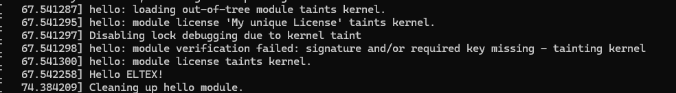

# Практическое задание №1

## Задание

Написать модуль ядра Hello World для своей версии ядра. Поменять описание модуля, добавить себя как автора и придумать свою лицензию.

## Сборка

```bash
make CC=x86_64-linux-gnu-gcc
```

Результаты помещаются в рабочую директорию в папку bin

## Подключение и отключение модуля

Подключение к ядру:

```bash
insmod bin/hello.ko
```

Отключение от ядра:

```bash
rmmod hello
```

## Результат запуска

```bash
dmesg | tail -10
```


