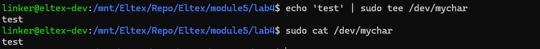

# Практическое задание №4

## Задание

Написать модуль ядра для своей версии ядра, который будет обмениваться информацией
с userspace через chardev.

## Сборка

```bash
make CC=x86_64-linux-gnu-gcc
```

Результаты помещаются в рабочую директорию в папку bin

## Подключение и отключение модуля

Подключение к ядру:

```bash
insmod bin/char.ko
```

Отключение от ядра:

```bash
rmmod char
```

## Результат запуска

```bash
echo 'testmsg' > /dev/mychar
cat /dev/mychar
```


