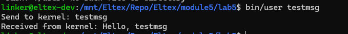

# Практическое задание №5

## Задание

Написать модуль ядра для своей версии ядра, который будет обмениваться информацией с userspace через netlink.

## Сборка

```bash
make CC=x86_64-linux-gnu-gcc
```

Результаты помещаются в рабочую директорию в папку bin

## Подключение и отключение модуля

Подключение к ядру:

```bash
insmod bin/netlink.ko
```

Отключение от ядра:

```bash
rmmod netlink
```

## Результат запуска

Для взаимодействия с модулем ядра используется пользовательское приложение user

```bash
bin/user testmsg
```


