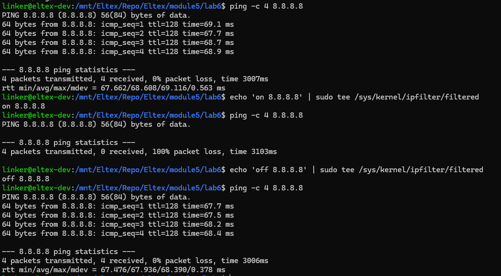
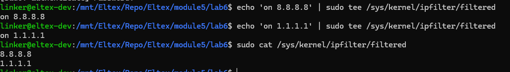

# Практическое задание №6

## Задание

Написать модуль ядра для своей версии ядра, который будет
фильтровать исходящие запросы по ip. Если адрес есть в списке, то пакет не отправлять.
Cделать добавление, удаление и список черных адресов через proc или sysfs.

## Сборка

```bash
make CC=x86_64-linux-gnu-gcc
```

Результаты помещаются в рабочую директорию в папку bin

## Подключение и отключение модуля

Подключение к ядру:

```bash
insmod bin/ipfilter.ko
```

Отключение от ядра:

```bash
rmmod ipfilter
```

## Результат запуска

Команды для управления модулем пишутся в /sys/kernel/ipfilter/filtered и имеют формат

```plain
<команда> <ip-адрес>
```

- on - добавить в список фильтрации;
- off - удалить из списка;

Максмум одновременно список может содержать 32 адреса.

```bash
ping -c 4 8.8.8.8
echo 'on 8.8.8.8' > /sys/kernel/ipfilter/filtered
ping -c 4 8.8.8.8
echo 'off 8.8.8.8' > /sys/kernel/ipfilter/filtered
ping -c 4 8.8.8.8
```



Текущий список фильтрации выводится при чтении /sys/kernel/ipfilter/filtered

```bash
echo 'on 8.8.8.8' > /sys/kernel/ipfilter/filtered
echo 'on 1.1.1.1' > /sys/kernel/ipfilter/filtered
cat /sys/kernel/ipfilter/filtered
```


